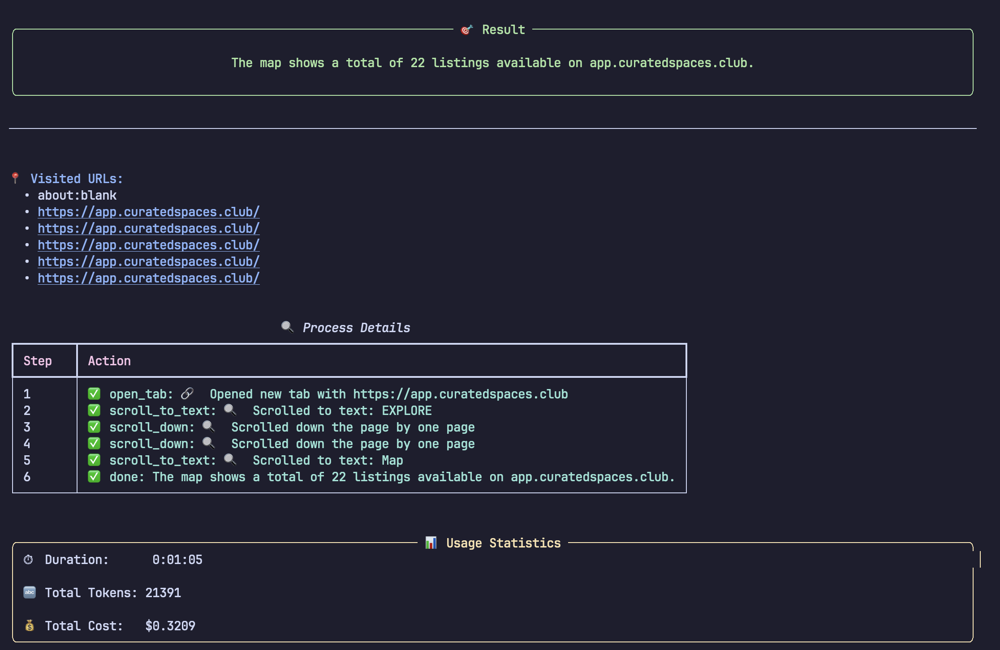

# Browser Agent Demo

A simple TUI for a browser automation agent using [browser_use](https://browser-use.com/) and [Langchain](https://www.langchain.com/).

## Setup

1. Create a `.env` file with your secrets:
```
OPENAI_API_KEY=your_openai_key
ANTHROPIC_API_KEY=your_anthropic_key
```

## Commands

Use the following make commands to manage the project:

- `make` - Creates environment, installs dependencies, and runs the agent
- `make venv` - Sets up virtual environment and installs dependencies
- `make run` - Ensures venv is set up and runs the agent
- `make clean` - Removes the virtual environment 

Example:
